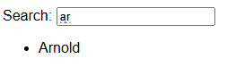

# Web Component based search element

Custom element that allows fuzzy searching the children of a container element.

Given the following HTML:

```html
<wc-search>
    <label for="list-search">Search:</label>
    <input type="text" id="list-search" name="search" />
    <ul>
        <li>Arnold</li>
        <li>Rufus</li>
        <li>Pinkie</li>
    </ul>
</wc-search>
```

Typing `ar` into the text input would result into:



Children elements that do not match the search are hidden with `display: none`.

## Running

To run the examples:

```sh
npm run serve

# open your browser on http://localhost:8000/index.html
```

To run the tests:

```sh
npm run test
```

## Why?

**TODO:**

* Experiment using custom elements to augment existing html functionality
* This gives you progressive enhancement for free
* More info in the blog post

## Overriding default behaviour

**TODO:**

* Explain search event behaviour
* How to cancel the default behaviour
* Alternative behaviour example

## License

[MIT](./LICENSE)
